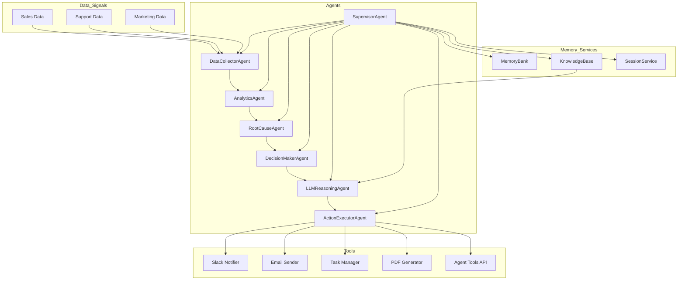

# 🤖 AIOCC — Enterprise AIOps Control Center  
### Autonomous Multi-Agent AIOps System powered by Gemini, Custom Tools, Memory, Sessions & OpenAPI

---

## 1. ⭐ Overview

**AIOCC (AI Operations Control Center)** is an end-to-end **Enterprise AIOps agent system** that autonomously:

- Ingests multi-department operational signals  
- Detects anomalies  
- Identifies root causes  
- Generates + refines remediation plans using **Gemini**  
- Executes actions (Slack, Email, Tasks, PDF Reports) via tools  
- Saves incidents into long-term memory & knowledge base  
- Maintains session state with pause/resume workflows  
- Uses OpenAPI tools via a FastAPI Tools API  

It simulates a realistic enterprise incident lifecycle:  
**Data → Insights → Anomalies → Root Cause → Plan → Gemini → Action → Memory.**

---

## 2. ⭐ Problem

Enterprise SRE & Ops teams face:

- Alert fatigue  
- Slow manual root cause analysis  
- High MTTR  
- Repetitive manual fixes  
- Context switching between dashboards, logs, tickets  

Most incidents follow **repeatable patterns**, but humans still perform the entire investigation manually.

AIOCC solves this with **autonomous incident analysis and remediation** using agent-based design.

---

## 3. ⭐ Solution

AIOCC implements a **multi-agent autonomous workflow**:

1. **DataCollectorAgent** loads synthetic operational data.  
2. **AnalyticsAgent** computes KPIs & detects anomalies.  
3. **RootCauseAgent** correlates anomalies across departments.  
4. **DecisionMakerAgent** drafts a remediation plan.  
5. **LLMReasoningAgent (Gemini)** refines the plan + produces human-readable analysis.  
6. **ActionExecutorAgent** executes actions through custom & OpenAPI tools.  
7. **SupervisorAgent** orchestrates full workflow.  
8. **SupervisorWithSession** adds long-running sessions & trace continuity.  

All incidents are stored in **MemoryBank** + **KnowledgeBase** for RAG-like future context.

---

## 4. ⭐ Key Features (Competition Requirements)

| Feature | Status | Notes |
|--------|--------|-------|
| Multi-agent system | ✔ | 8 specialized agents |
| Custom tools | ✔ | Slack, Email, PDF, Tasks, DataFetcher |
| OpenAPI tools | ✔ | FastAPI Tools API |
| Sessions & state | ✔ | SessionService |
| Long-running ops | ✔ | Pause/resume |
| LLM agent (Gemini) | ✔ | Reasoning agent |
| Memory | ✔ | MemoryBank + KnowledgeBase |
| Observability | ✔ | Centralized logging |

Your project satisfies **7+ required features** (only 3 required).

---

## 5. ⭐ Architecture Diagram (Mermaid)



---

## 6. ⭐ Agent Descriptions

### **DataCollectorAgent**  
Loads signals from CSV via DataFetcher.

### **AnalyticsAgent**  
Computes KPIs & identifies anomalies.

### **RootCauseAgent**  
Correlates anomalies to suggest root causes.

### **DecisionMakerAgent**  
Turns root causes into a remediation plan.

### **LLMReasoningAgent (Gemini)**  
Refines remediation plan & produces explanations.

### **ActionExecutorAgent**  
Executes actions using:
- Slack  
- Email  
- Task creation  
- PDF reports  
- OpenAPI tools  

### **SupervisorAgent**  
Orchestrates full workflow.

### **SupervisorWithSession**  
Adds long-running execution + pause/resume.

---

## 7. ⭐ Memory & Sessions

### **MemoryBank**  
Stores:
- Incidents  
- KPI baselines  
- Root cause mappings  
- Remediation actions  

### **KnowledgeBase**  
Provides RAG-style retrieval of similar past incidents.

### **SessionService**  
Tracks:
- execution state  
- last trace  
- active / paused / finished session  

---

## 8. ⭐ Tools System

### **Custom Tools**
- SlackNotifier  
- EmailSender  
- PDFReportGenerator  
- TaskManager  
- DataFetcher  

### **OpenAPI Tools (FastAPI)**  
Endpoints:
```
/openapi/slack
/openapi/task
/email
```

---

## 9. ⭐ Project Structure

```
AIOCC-Enterprise-Agent/
│
├── data/
├── src/
│   ├── agents/
│   ├── tools/
│   ├── services/
│   ├── agent_tools_api/
│   ├── utils/
│   └── config.py
│
├── run_cycle.py
├── requirements.txt
├── Dockerfile
├── .env.example
└── DEPLOYMENT_GUIDE.md
```

---

## 10. ⭐ Local Setup

### Install

```bash
git clone https://github.com/nikhilvadlaa/AIOCC-Enterprise-Agent.git
cd AIOCC-Enterprise-Agent

python -m venv .venv
source .venv/bin/activate
pip install -r requirements.txt
```

### Environment

```bash
cp .env.example .env
```

Set:

```
DEMO_MODE=true
```

---

## 11. ⭐ Run an Incident Cycle

```bash
python run_cycle.py
```

---

## 12. ⭐ Deployment (Docker / Cloud Run)

### Build

```bash
docker build -t aiocc-agent .
```

### Run

```bash
docker run --env-file .env aiocc-agent
```

Cloud instructions:

```
DEPLOYMENT_GUIDE.md
```

---

## 13. ⭐ Use Cases

- Support / sales / marketing surge detection  
- Anomaly-driven incident creation  
- Autonomous OPs remediation  
- SRE co-pilot  
- Past incident RAG reasoning  

---

## 14. ⭐ License

MIT License.
