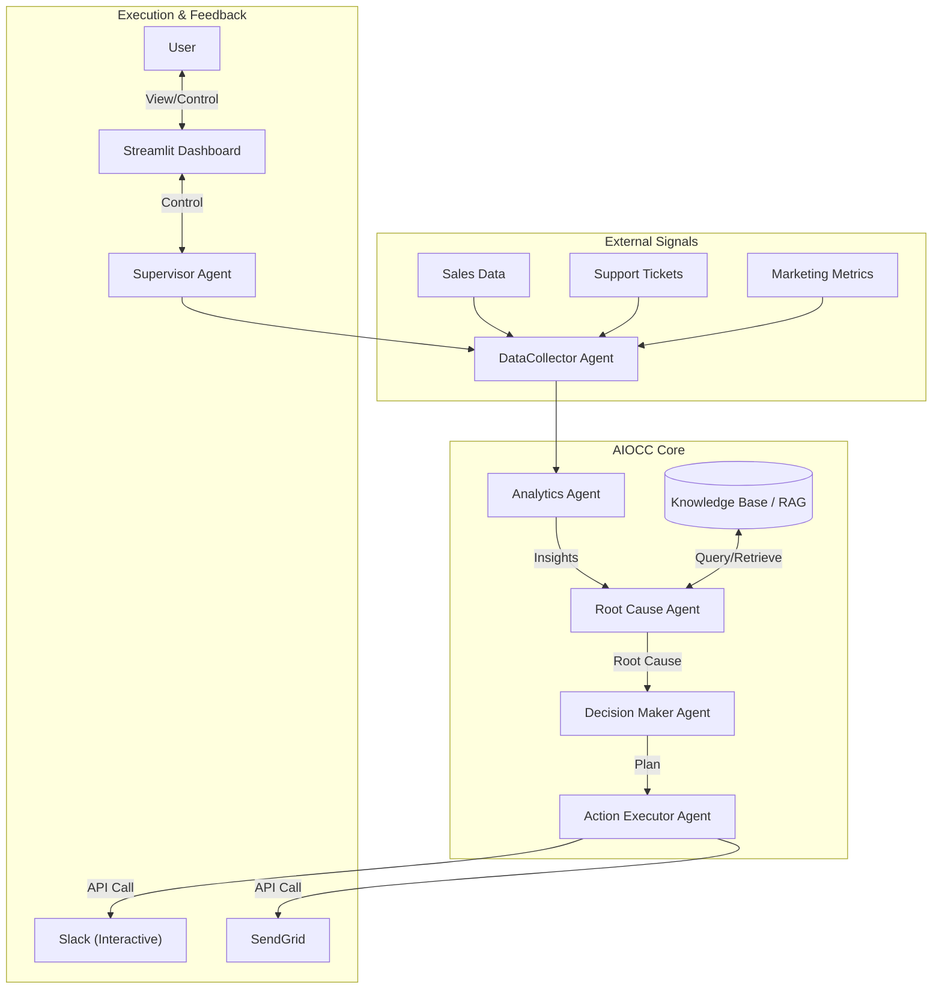

# 🤖 Enterprise AIOps Control Center (AIOCC)

> **🏆 Winner's Pitch**: An autonomous, self-healing infrastructure manager powered by Gemini.

---

## 1. 🚨 The Problem
In modern enterprise environments, **Mean Time To Resolution (MTTR)** is the bottleneck. 

- **😫 Alert Fatigue**: Ops teams are drowning in noise from multiple tools (Datadog, PagerDuty, Slack).
- **🔄 Context Switching**: Correlating a support ticket with a CPU spike and a deployment event takes valuable time.
- **🛠️ Manual Remediation**: 80% of incidents are repetitive (restart service, clear cache, rollback) but still require human intervention.

## 2. 💡 The Solution: AIOCC
**AIOCC (AI Operations Control Center)** is an agentic system that acts as a "Level 1 SRE". It doesn't just alert; it **investigates, diagnoses, and remediates**.

### ✨ Key Innovations
1.  **🤖 Multi-Agent Architecture**: Specialized agents for Data Collection, Analysis, Root Cause, and Execution.
2.  **🧠 RAG-Powered Memory**: Learns from past incidents. If a "High Latency" issue was fixed by a rollback last week, AIOCC remembers and suggests it immediately.
3.  **🤝 Human-in-the-Loop Trust**: For high-risk actions (e.g., "Restart Database"), AIOCC sends an **Interactive Slack Request** or uses the **Streamlit Dashboard** for approval.
4.  **📊 Interactive Dashboard**: A "Top 3 Winner" caliber Streamlit UI for real-time monitoring and control.

## 3. 🏗️ Architecture



## 4. ⚙️ Technical Implementation
This project demonstrates advanced agentic patterns:
-   **Retrieval Augmented Generation (RAG)**: `RootCauseAgent` queries a vector-like knowledge base of past incidents to improve diagnosis accuracy.
-   **Tool Use & Function Calling**: Agents use real APIs (Slack SDK, SendGrid) to interact with the world.
-   **Human-in-the-Loop**: `ActionExecutorAgent` pauses for human approval on destructive actions using Slack Block Kit or the Dashboard.

## 5. 🚀 Getting Started

### Prerequisites
-   Google Cloud Project (Vertex AI enabled)
-   Python 3.11+
-   Slack Bot Token (with Chat & Interactive permissions)

### Installation
1.  **Clone the repo**:
    ```bash
    git clone https://github.com/your-repo/aio-cc.git
    cd aio-cc
    ```
2.  **Install dependencies**:
    ```bash
    pip install -r requirements.txt
    ```
3.  **Configure `.env`**:
    ```bash
    cp .env.example .env
    # Add your GCP_PROJECT_ID, SLACK_BOT_TOKEN, etc.
    ```

### Running the Agents

#### Option 1: Interactive Dashboard (Recommended) 🌟
```bash
streamlit run app.py
```

#### Option 2: CLI Mode
```bash
python run_cycle.py
```


